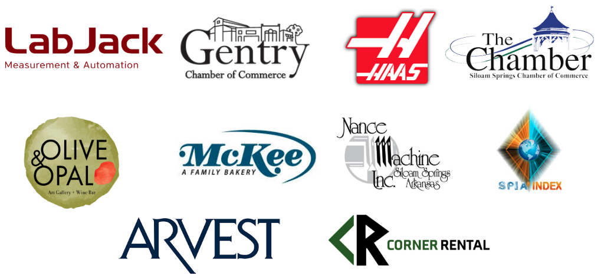

# GEARS 2025 Workshop  
**August 11–15, 2025 | Gentry, Arkansas, USA**

🎉 We’re celebrating **five years of GEARS** in 2025! This page is your go-to hub for all the essentials.

> *"This workshop should be required in every graduate program that does field work."*

---

## During the Workshop

* [Workshop Schedule](https://docs.google.com/spreadsheets/d/1mL5oBOXQ8svQjKmVeLk89pZyld7fiX_PDNDDkVFo4Nc/edit?usp=sharing)

---

## 🍽 Lodging, Travel, and Meals

Participants are **responsible for their own lodging, transportation, and meals**, but we make it easy:

- 🧭 Our [Travel Info Page](../travel.md) includes local lodging, airport, and other information.
- 🍴 We have been able to secure sponsored lunches for workshop days!
- 🔥 One evening during the week, we host a **free BBQ dinner** at Leeman house — a great time to relax, network, and nerd out.

---

## 🤝 Partners & Sponsors

GEARS wouldn’t be possible without support from the local community. We proudly partner with regional businesses and organizations to enhance the workshop experience and give students real-world exposure to how things are made.

These partnerships provide opportunities like:
- 🚛 Behind-the-scenes **factory tours**
- 🛠 Demos of real-world production tools and workflows
- 🍽 **Sponsored lunches** so students can focus on learning, not logistics
- 💬 Informal networking with engineers, machinists, and shop owners

---

## 🎓 Questions or Problems?

Email us at **support@leemangeophysical.com** or call the office at 479-373-3736.

---

## 💸 Refund & Cancellation Policy

- **No refunds** after July 1  

---

## 🕰 GEARS Through the Years

Curious what the GEARS experience is like? Check out blog posts and recaps from previous workshops to see student projects, photos, and what we covered each year:

- 🔧 [GEARS 2024 Workshop Recap](https://leemangeophysical.com/gears-2024-workshop/)
- 🛠 [GEARS 2023 Workshop Recap](https://leemangeophysical.com/gears-2023-workshop/)
- 🧪 [GEARS 2022 Workshop Recap](https://leemangeophysical.com/gears-2022-workshop/)
- ⚙️ [GEARS 2021 Workshop Recap](https://leemangeophysical.com/gears-2021-workshop/)

Each year we refine the workshop with student feedback, new tech, and more hands-on tools. GEARS 2025 will build on everything we’ve learned — and it’s going to be our best yet.

> *"I enjoyed learning about the topics and liked applying them in the shop, and I know I will use these skills in the future."*
