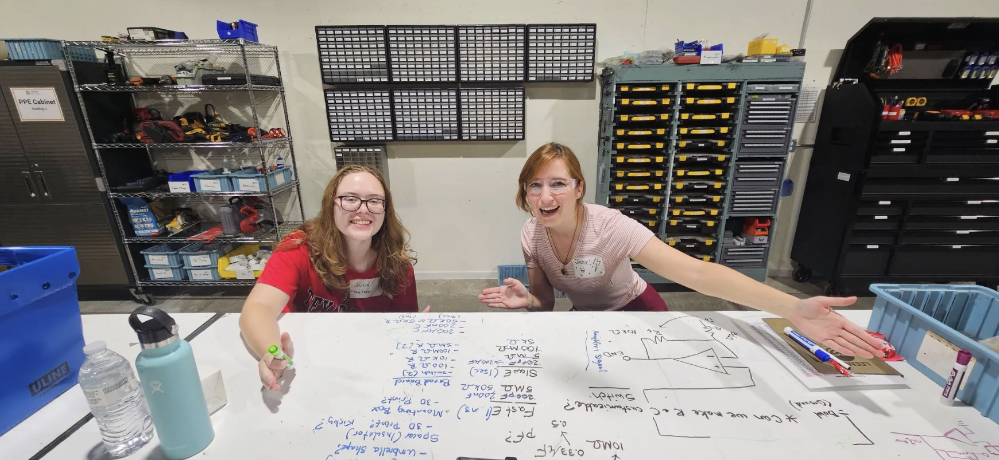
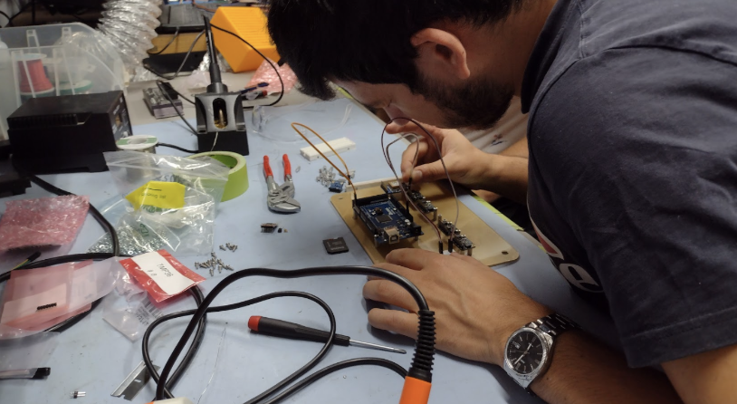
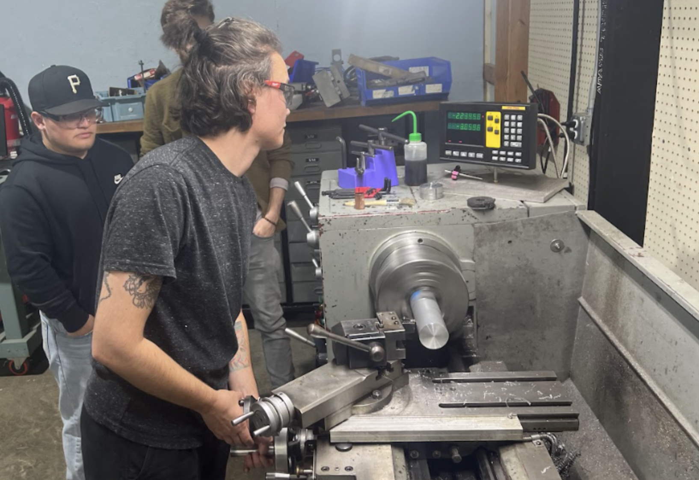
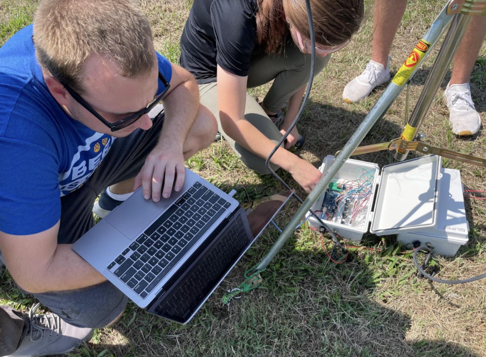
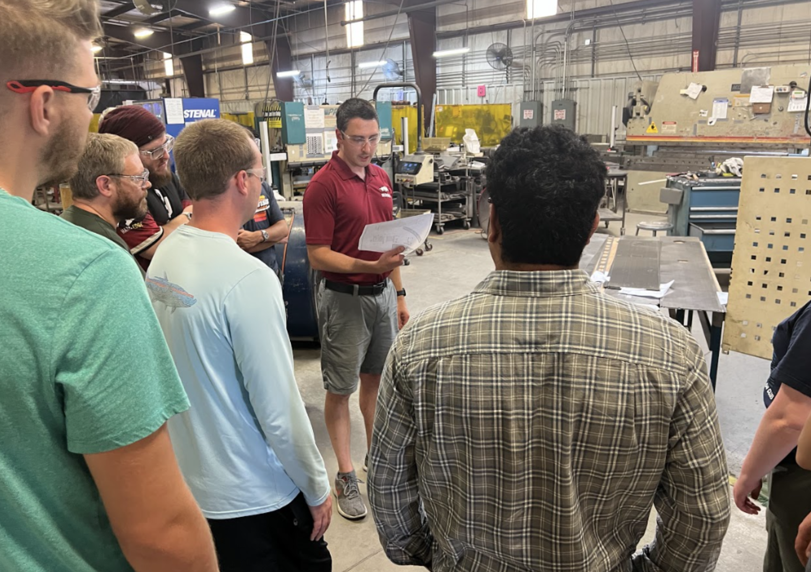
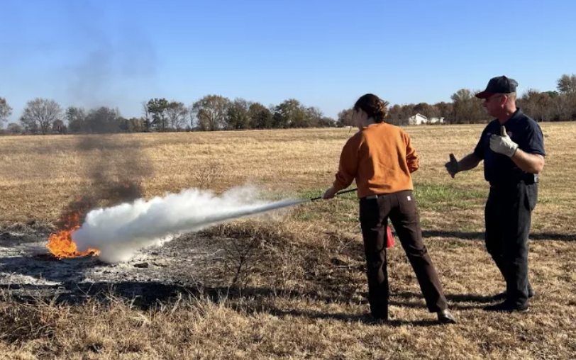

# GEARS 2025 Workshop  
**August 11–15, 2025 | Gentry, Arkansas, USA**

🎉 We’re celebrating **five years of GEARS** in 2025! This page is your go-to hub for all the essentials: what GEARS is, how to register, what to expect, and how to plan your visit.

> 📣 **[Click here to register now!](https://forms.gle/1n6Dtky2T6zVgUvH8)**  
> *Only 16 spots available — registration closes June 1, 2025!*

> *"This workshop should be required in every graduate program that does field work."*
---

## 🔧 What is GEARS?

GEARS stands for **Generalist Electromechanics for Applied Researchers** — a hands-on, interdisciplinary workshop designed to help scientists build confidence working with hardware in the lab and in the field.

If you’re a scientist, you collect data. And if you collect data, **you need GEARS.**

You’ll learn:
- Safety (put out a live fire!)
- Basic electronics & troubleshooting
- Sensors & transducers
- Solar power systems
- Analog-to-digital converters
- Instrumentation interfaces
- Circuit design & PCB layout
- 3D printing & mechanical prototyping
- Power distribution & protection systems
- And More!

The skills are broadly applicable across Earth science, physics, engineering, biology, and beyond.

> *"This workshop has been the best workshop I have ever attended. I learned so much and gained more confidence in my abilities and skills. This will help SO much in my research."*

---

## 🕰 GEARS Through the Years

Curious what the GEARS experience is like? Check out blog posts and recaps from previous workshops to see student projects, photos, and what we covered each year:

- 🔧 [GEARS 2024 Workshop Recap](https://leemangeophysical.com/gears-2024-workshop/)
- 🛠 [GEARS 2023 Workshop Recap](https://leemangeophysical.com/gears-2023-workshop/)
- 🧪 [GEARS 2022 Workshop Recap](https://leemangeophysical.com/gears-2022-workshop/)
- ⚙️ [GEARS 2021 Workshop Recap](https://leemangeophysical.com/gears-2021-workshop/)

Each year we refine the workshop with student feedback, new tech, and more hands-on tools. GEARS 2025 will build on everything we’ve learned — and it’s going to be our best yet.

> *"I enjoyed learning about the topics and liked applying them in the shop, and I know I will use these skills in the future."*

---

## 👥 Who Should Attend?

Anyone! GEARS is ideal for:
- Graduate students
- Early-career researchers
- Undergraduates with technical interest
- Faculty looking to build skills or expand their teaching
- Industry folks who need practical instrumentation knowledge

We’ve had everyone from freshmen to full professors successfully complete GEARS. If you’re excited about **building, fixing, and learning**, you’ll fit right in.

> *"The amount of material and hands-on work I got to learn and do was awesome."*

---

## 📍 When & Where?

**🗓 August 11–15, 2025**  
**📍 Leeman Geophysical LLC — Gentry, Arkansas, USA**

We’re located in Northwest Arkansas, with the XNA airport providing direct service to many destinations. Full travel guidance is available on our [Travel Info Page](../travel.md).

---

## 📝 Registration Info

**💰 Cost:** $750 per student  
**⏳ Deadline:** Registration closes June 1, 2025  
**📋 [Register Now](https://forms.gle/1n6Dtky2T6zVgUvH8)** — first come, first served!

After you submit the registration form, we’ll send an invoice. Your spot is secured **once payment is received**.

> ⚠️ We only accept **16 students** to keep the experience personal and hands-on. Once full, a short waitlist will be started and registration will close.

> *"I would send every second or rising second year student here before working on instruments. It’s invaluable as a knowledge base before working in the field."*

---

## 💸 Refund & Cancellation Policy

- Cancel **by June 1**: Refund of $700  
- Cancel **by July 1**: Refund of $300  
- **No refunds** after July 1  

If you need to cancel, email us as soon as possible so we can offer your spot to someone on the waitlist.

---

## 🍽 Lodging, Travel, and Meals

Participants are **responsible for their own lodging, transportation, and meals**, but we make it easy:

- 🧭 Our [Travel Info Page](../travel.md) includes local lodging, airport, and other information.
- 🍴 We’re currently working to **arrange sponsored lunches** for workshop days.
- 🔥 One evening during the week, we host a **free BBQ dinner** at Leeman house — a great time to relax, network, and nerd out.

---

## 🤝 Partners & Sponsors

GEARS wouldn’t be possible without support from the local community. We proudly partner with regional businesses and organizations to enhance the workshop experience and give students real-world exposure to how things are made.

These partnerships provide opportunities like:
- 🚛 Behind-the-scenes **factory tours**
- 🛠 Demos of real-world production tools and workflows
- 🍽 **Sponsored lunches** so students can focus on learning, not logistics
- 💬 Informal networking with engineers, machinists, and shop owners

We’ll update this section as sponsors for GEARS 2025 are confirmed.

> **Want to support GEARS?**  
> We’re currently accepting sponsors for workshop lunches and other in-kind contributions.  
> **Email [support@leemangeophysical.com](mailto:support@leemangeophysical.com)** to learn how to get involved!

---

## 🎓 Questions?

Email us at **support@leemangeophysical.com** or call the office at 479-373-3736.

---

🚀 **Ready to join us?**  
👉 [Register here](https://forms.gle/1n6Dtky2T6zVgUvH8) before June 1!

